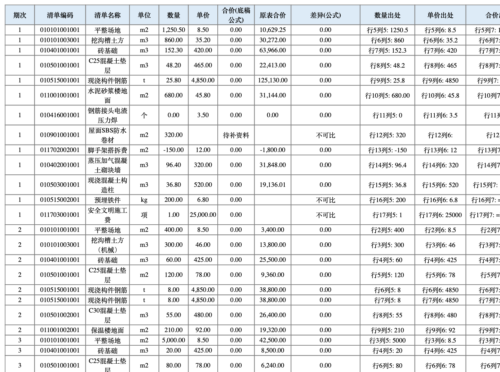

# CostGuard

**Engineering Cost & Compliance Intelligence Workbench** (工程经营合规智能工作台)

CostGuard is a local-first desktop application for construction cost engineers and
contract/compliance staff. Its first public workflow is:

```
Excel import → field standardization → quantity/unit-price/amount checks
→ synonymous item grouping → upstream/downstream differences
→ anomaly detection → Excel/Word reports
```

> **Status: v0.1.2 preview.** The seven-step core workflow, the macOS GUI and an
> **unsigned, ad-hoc signed macOS DMG** (Apple Silicon) are available. See the
> [release notes](docs/RELEASE_NOTES_v0.1.2.md) and the
> [3-minute quick start (中文)](docs/QUICKSTART_zh-CN.md).


## Why CostGuard

- **Accuracy over automation rate.** Deterministic math (quantities × unit price ×
  amounts, tax, cumulative totals) is always computed by the program with exact
  `Decimal` arithmetic — never by an LLM, never by float.
- **Your original files are never modified.** Imports are copied to a read-only
  store; all outputs go to a separate workspace.
- **Every number is traceable.** Conclusions link back to
  `file → sheet/page → cell/paragraph → original content` via Evidence IDs.
- **No silent fixes.** Missing data is marked `待补资料` (pending), incomparable
  data `不可比` (incomparable) — never auto-filled with 0, never force-balanced.
- **Human in the loop.** Uncertain matches carry confidence levels and enter a
  review queue; every manual correction is logged with a reason.

## Platform priority

1. **P0 — macOS Apple Silicon (arm64)** — current focus
2. **P1 — Windows x64** (same shared core, platform layer isolates differences)
3. P2 — Intel mac / Windows ARM64 / Linux: decided later

## Tech stack

Python 3.12 · PySide6 · SQLite · openpyxl/xlrd · pandas · rapidfuzz · pdfplumber · python-docx

## Install on macOS Apple Silicon (regular users)

Download `CostGuard-<version>-macos-arm64.dmg` from
[Releases](https://github.com/fahaxiki67/costguard/releases), open it, drag
**CostGuard.app** into **Applications**, and launch. No Python, uv or terminal
required. The build is **ad-hoc signed and NOT notarized**: on first launch macOS
may ask you to right-click the app and choose **Open** — this is expected and
documented in the [quick start](docs/QUICKSTART_zh-CN.md). Verify downloads with
the published `SHA256SUMS.txt`.

First run: click **体验匿名演示** (Try the anonymous demo) to walk the full
workflow — import → standardize → Decimal checks → matching → up/down
differences → anomalies → Excel/Word export — with fully synthetic demo data.



More screenshots: [examples/screenshots/](examples/screenshots/) ·
完整图文步骤（中文）：[三分钟上手](docs/QUICKSTART_zh-CN.md) ·
Screenshots are generated from the real running app by
`scripts/generate_screenshots.py` and can be reproduced locally.

## Run from source

```bash
brew install uv
git clone https://github.com/fahaxiki67/costguard.git
cd costguard
uv sync --python 3.12
uv run costguard
```

In the app: create a project → import Excel files → mark periods as upstream or
downstream → run cross-checks/anomalies/matching → review uncertain items → export.

For development:

```bash
uv sync --python 3.12 --extra dev
uv run pytest
uv run ruff check src scripts tests
```

## License

Licensed under the [Apache License 2.0](LICENSE). See
[ADR-009](docs/adr/ADR-009-license-deferral.md) for the decision record.

## Current limitations

- Settlement reconciliation currently focuses on `.xlsx`, `.xls`, and `.csv` inputs.
- `.docx`, text PDF, and `.txt` clause extraction is preliminary and always requires
  human review against the quoted page or paragraph.
- Legacy `.doc` and image OCR are not yet implemented in the application.
- WPS compatibility has passed a synthetic minimum sample; the latest private real-data
  exports remain a separate conditional acceptance gate.
- The macOS DMG is **ad-hoc signed, not notarized** (first-launch right-click Open
  may be required); a Developer-ID signed and notarized build is future work.
- Building the DMG requires macOS Apple Silicon; see
  `scripts/build_macos_arm64.sh` and the manual packaging workflow
  (`.github/workflows/package-macos-arm64.yml`).

## Documentation

- [中文说明 README_zh-CN.md](README_zh-CN.md) · [三分钟上手 QUICKSTART（中文）](docs/QUICKSTART_zh-CN.md)
- [Architecture](ARCHITECTURE.md) · [Roadmap](ROADMAP.md) · [AGENTS principles](AGENTS.md)
- ADRs: `docs/adr/`

## Reporting issues

See [CONTRIBUTING.md](CONTRIBUTING.md). Security-sensitive reports: [SECURITY.md](SECURITY.md).
