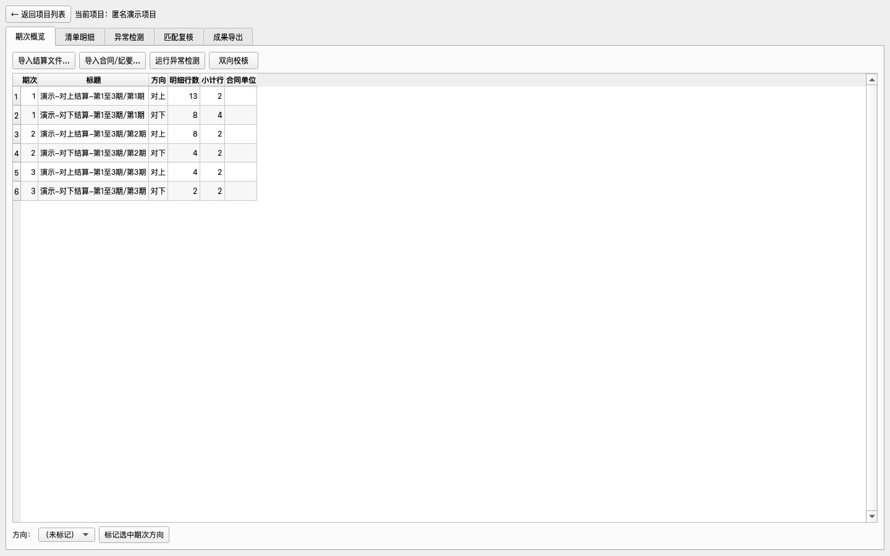
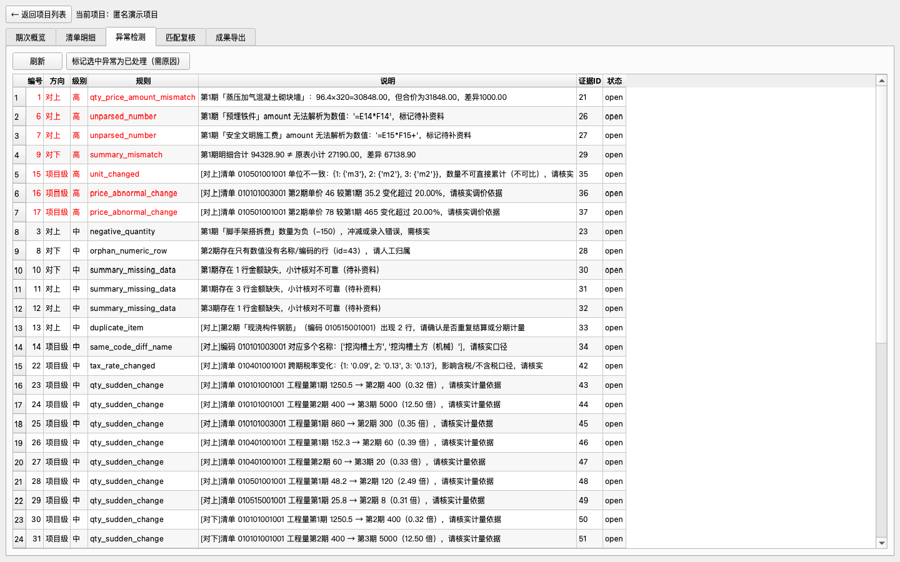

# CostGuard — 工程经营合规智能工作台

面向工程造价、经营合规、合同、结算、考核和管理汇报的**本地单机**智能工作台。

它不是聊天机器人，而是一条标准化、可复核、可追溯的工程结算工作流水线：

```
Excel 导入 → 清单字段标准化 → 工程量/单价/总价校核 → 同义材料归并
→ 对上对下差异 → 异常项识别 → Excel/Word 报告导出
```

> 当前状态：**v0.1.6 预览版**。七步主链和 Mac 图形界面已可运行，并提供
> **未公证、ad-hoc 本地签名的 macOS DMG**（Apple Silicon 原生）。
> 详见[发布说明](docs/RELEASE_NOTES_v0.1.6.md)和
> [三分钟上手](docs/QUICKSTART_zh-CN.md)。



## 解决什么问题

把大量重复性的工程经营分析和结算核对工作，变成：

- **准确**：数量、单价、金额等确定性计算全部由程序用 `Decimal` 精确完成，
  不依赖 AI 心算，不使用浮点数。
- **可追溯**：每个结论可点击回溯至
  `原始文件 → Sheet/页码 → 行列/段落 → 原始内容`（证据链 Evidence ID）。
- **可复核**：双向校核（A: 各期金额直接累计；B: 明细重算）差异必须显式呈现；
  涉及金额的结果至少一次独立交叉校验。
- **不擅动数据**：原始文件只读（导入即复制副本）；缺失数据标记"待补资料"，
  不自动填 0；无法比较标记"不可比"；不为金额一致而人为调平。
- **人在回路**：自动匹配显示置信度（规则完全匹配〔待人工确认〕/高概率匹配/疑似匹配/不可比/待补资料）
  并进入人工复核队列；人工修正记录原因。

## 适用场景

- 多期结算（对上/对下）累计核对、单价与工程量差异分析
- 合同、补充协议、签证、变更、会议纪要的条款结构化与风险提示
- 管理层汇报材料（异常清单、待核实事项、证据索引、摘要）
- Excel 审核底稿（尽量保留公式，兼容 WPS Office）

## 已实现的七步主链

| 步骤 | 当前行为 | 安全边界 |
|---|---|---|
| Excel 导入 | 支持 `.xlsx`、`.xls`、`.csv`，保留公式、缓存值、合并单元格、隐藏行列等信息 | 原文件不修改；副本和 SHA-256 可追溯 |
| 字段标准化 | 识别常见清单编码、名称、特征、单位、工程量、单价、合价和税率字段 | 低置信度或歧义表头进入人工确认，不猜测 |
| 数量/单价/总价校核 | `Decimal` 复算数量 × 单价，对照原表金额并做 A/B/C 路径校核 | 缺失不填 0，差异不调平 |
| 同义材料归并 | 按编码、规范化名称、单位和已确认别名形成候选组 | 相似名称不会直接视为已确认；单位不一致标记不可比 |
| 对上对下差异 | 按方向和期次独立累计，生成工程量、单价和金额差异 | 对上、对下不串表，不默认计算跨方向净额 |
| 异常项识别 | 检查金额不符、重复、漏项、单位/单价/税率变化、公式错误等 | 每项保留规则、级别、证据 ID 和处理状态 |
| 导出报告 | 导出带基础格式、公式、异常、待核实事项和证据索引的 Excel，以及 Word 摘要 | 自动结果不等于已批准业务结论 |

## 平台优先级

1. **P0 — macOS Apple Silicon（M1/M2/M3/M4，当前开发重点）**
2. P1 — Windows x64（共享同一核心引擎，平台差异隔离在适配层）
3. P2 — Intel Mac / Windows ARM64 / Linux：视需求再定

## 安装与运行

### 普通用户（macOS Apple Silicon，推荐）

1. 从 [Releases](https://github.com/fahaxiki67/costguard/releases) 下载
   `CostGuard-<版本号>-macos-arm64.dmg`，可用 `SHA256SUMS.txt` 校验。
2. 双击打开 DMG，把 **CostGuard.app** 拖入 **Applications**。
3. 从"应用程序"启动。**当前版本未做 Apple 公证**：首次打开如提示"无法验证开发者"，
   在应用程序文件夹**右键 → 打开**即可（详见[三分钟上手](docs/QUICKSTART_zh-CN.md)）。
4. 点击 **「体验匿名演示」**，三分钟走完
   导入 → 标准化 → Decimal 金额校核 → 同义匹配 → 对上对下差异 → 异常检测 →
   Excel/Word 导出 的完整流程（全程使用完全合成的匿名演示数据）。



更多截图见 [examples/screenshots/](examples/screenshots/)，图文步骤见
**[三分钟上手 QUICKSTART_zh-CN](docs/QUICKSTART_zh-CN.md)**。
截图由 `scripts/generate_screenshots.py` 驱动真实运行的程序生成，可在本地复现。

### 开发者（源码运行）

```bash
brew install uv
git clone https://github.com/fahaxiki67/costguard.git
cd costguard
uv sync --python 3.12
uv run costguard
```

第一次使用：

1. 新建项目并选择独立工作目录。
2. 导入对上/对下 Excel，核对识别出的期次和字段；必要时人工确认。
3. 标记每个期次的“对上”或“对下”方向。
4. 运行“双向校核”“异常检测”和“匹配”，复核不确定项。
5. 在“成果导出”中生成 Excel 审核底稿和 Word 摘要。

开发者运行测试：

```bash
uv sync --python 3.12 --extra dev
uv run pytest
uv run ruff check src scripts tests
```

## 数据安全原则

- 全部数据保存在本机你选择的工作空间目录中，不联网上传。
- 软件自身配置与工程数据严格分离，升级不影响项目资料。
- 数据库结构带版本号，升级迁移前自动备份、失败可回滚。
- 真实工程资料禁止进入代码仓库（`local_private_data/` 已隔离）。

## 已知限制

- 当前结算核对以 Excel（xlsx/xls/csv）为主。
- docx、文本型 PDF 和 txt 的条款提取已提供初步能力，自动结果必须回到引用页码或段落人工复核。
- 旧版 doc 和图片 OCR 尚未在程序中实现；扫描资料不得直接形成业务结论。
- 合成最小样例已完成人工 WPS 验证；不同 WPS/Office 版本仍建议用自己的匿名化样例复核。
- LLM 辅助功能默认关闭，全部核心功能可离线运行。
- 软件提示新版本但不自动更新，由用户决定是否升级。
- 当前 DMG 为 **ad-hoc 本地签名、未公证** 的预览版：首次启动可能需要右键打开；
  签名公证版是后续工作。打包构建见 `scripts/build_macos_arm64.sh` 与
  手动打包工作流 `.github/workflows/package-macos-arm64.yml`。

## 开发路线

见 [ROADMAP.md](ROADMAP.md)（Phase 0–18，从 Mac 最小框架到跨平台 V1.x）。

## 开源许可证与参与方式

- CostGuard 使用 [Apache License 2.0](LICENSE)。
- 欢迎提交 Issue、复现样例、规则建议和 Pull Request；优先处理带匿名化样例和可重复验收标准的问题。
- 真实合同、结算表、企业数据、个人信息和账号凭证不得上传到公开 Issue、PR 或仓库。

## 文档

- [三分钟上手 QUICKSTART_zh-CN](docs/QUICKSTART_zh-CN.md) · [英文说明 README.md](README.md)
- [架构 ARCHITECTURE.md](ARCHITECTURE.md) · [路线图 ROADMAP.md](ROADMAP.md) · [开发原则 AGENTS.md](AGENTS.md)
- 架构决策记录：`docs/adr/`

许可证决策见 [ADR-009](docs/adr/ADR-009-license-deferral.md)，贡献规则见 [CONTRIBUTING.md](CONTRIBUTING.md)。

## 报告问题

见 [CONTRIBUTING.md](CONTRIBUTING.md)；安全问题按 [SECURITY.md](SECURITY.md) 处理。
