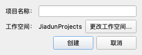
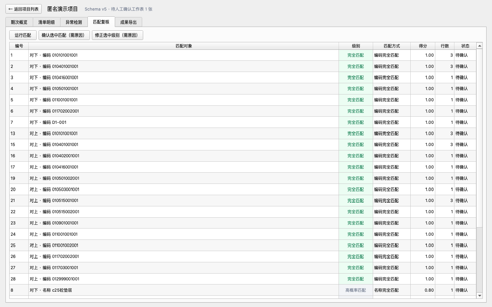
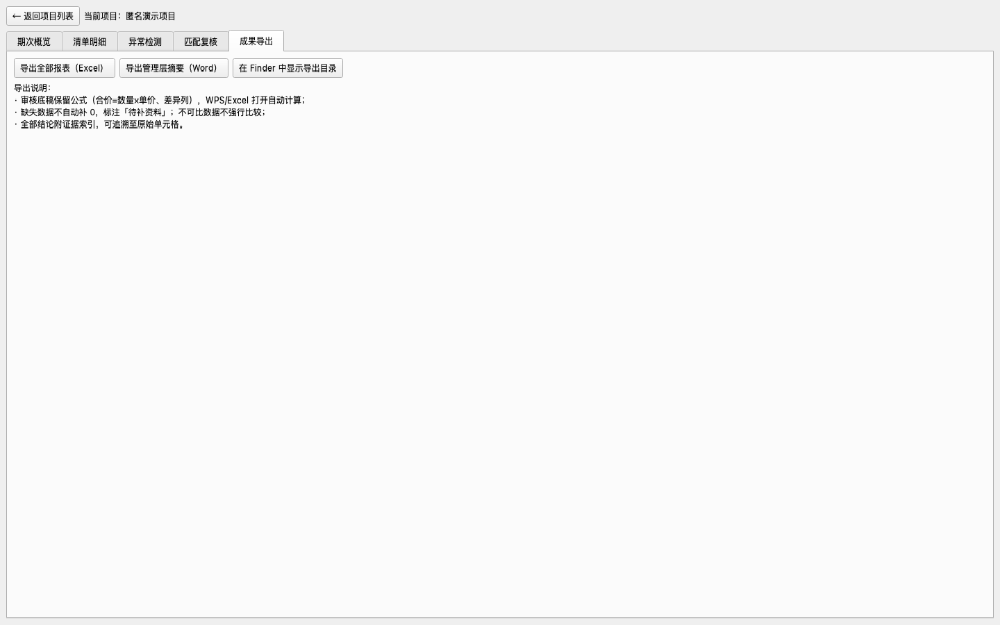
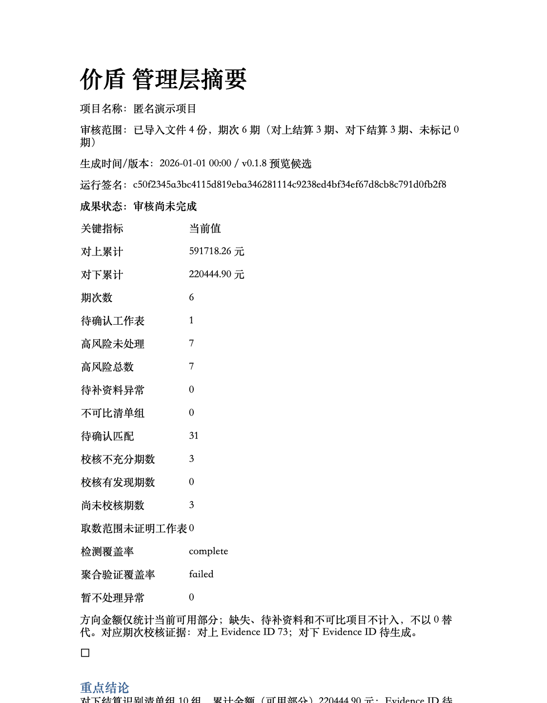

# Jiadun（价盾）三分钟上手（macOS Apple Silicon）

> 面向第一次使用价盾的普通用户：不需要安装 Python、uv 或任何开发工具。
> 全程只使用程序生成的**匿名演示数据**，不涉及任何真实工程资料。
>
> 以下截图来自真实运行的价盾（由 `scripts/generate_screenshots.py` 渲染生成）。在相同
> 受控环境可复现视觉布局和像素内容；跨系统 PNG 编码、QuickLook 元数据和字体渲染
> 不承诺字节级 SHA-256 一致，导出预览依赖 macOS QuickLook。

## 第 0 分钟：安装

1. 下载 `Jiadun-<版本号>-macos-arm64.dmg`，双击打开。
2. 把 **Jiadun.app** 拖入旁边的 **Applications** 文件夹。
3. 从"启动台"或"应用程序"文件夹启动价盾。

> **首次打开提示**：当前版本未做 Apple 公证，第一次打开如果 macOS 提示
> "无法验证开发者"，请在 **应用程序** 文件夹里**右键点击 Jiadun → 打开**，
> 再点"打开"确认；此操作只需做一次。安装包为 ad-hoc 本地签名预览版，
> Gatekeeper 提示因系统设置而异，无法承诺"完全不出现提示"。
>
> 验证 DMG 完整性（可选）：终端执行
> `shasum -a 256 <下载的dmg文件>`，与发布页公布的 SHA-256 对比。

## 第 1 分钟：开始一个工程项目

1. 启动后进入**项目列表**页，首页默认保持空白，不会自动加载演示项目、临时目录或
   旧版项目。把结算/合同资料拖到中间的拖拽区，或点击 **「导入资料文件…」** /
   **「导入资料文件夹…」**；价盾会先让你确认项目名称，再创建项目并导入只读副本。
   文件夹会递归扫描，XLSX/XLSM/XLS/CSV 进入结算导入，DOCX/PDF/TXT 进入合同/纪要提取。
2. 如果已有价盾项目，点击 **「打开已有项目…」**，选择目录内含 `project.db` 的项目目录。
   这个按钮只用于打开项目，不用于选择原始 Excel 或合同文件；选择器中普通文件置灰是正常的。
3. 也可以不用资料入口：点 **「新建项目」** 自己命名——你的工程资料默认保存在
   本机 `~/Documents/JiadunProjects/<项目名>/`，**只保存在你的电脑上**，
   不联网上传。
4. 导入的原始文件会被**只读复制**到项目 `originals/` 目录（带 SHA-256 登记），
   程序绝不修改你的原件；所有产出写入项目的 `exports/` 目录。
   卸载 Jiadun.app 不会删除你的项目资料。

如果只是想体验完整流程，可在首页明确点击 **「体验匿名演示」**；该按钮会创建
完全合成的「匿名演示项目」，不会在启动时自动出现。

## 第 2 分钟：跑一遍完整流程

在演示项目的工作台里有五个标签页：**期次概览 | 清单明细 | 审核问题中心 | 匹配复核 | 成果导出**。

1. **期次概览**：能看到 6 个期次——对上第 1–3 期、对下第 1–3 期（演示数据里
   对上/对下用了相同期号，但程序按方向隔离，永不混算、不默认合并净额）。
2. 选中一个期次，用下方"方向"下拉和 **「标记选中期次方向」** 按钮体验方向标记
   （需填写原因，写入审计日志）。演示数据已按文件预标方向。
3. 点 **「双向校核」**：程序用 `Decimal` 精确复算每一行的 数量 × 单价 与合价，
   按 A（各期直接累计）/ B（明细重算汇总）两条独立路径交叉核对。
4. 点 **「运行异常检测」**：演示数据埋了典型问题——金额不符、一分钱舍入差异、
   重复行、漏项、单位/单价/税率变化、公式无缓存、文本数字、负数冲减等，
   每条异常都带证据 ID 和方向。
5. 点 **「运行匹配」**：同编码同名归为"规则完全匹配（待人工确认）"，无编码近名行
   进入"高概率匹配"，缺名称行进入"待补资料"。**所有不确定项必须人工确认**，
   确认时要填写原因。

6. 注意「人材机汇总」这类汇总表：价盾**不会猜测**它的角色，会停在
   "待人工角色确认"，未经确认绝不写入正式结算清单。

## 第 3 分钟：看证据、出成果

1. **清单明细**页：每一行都能看到数量/单价/合价和"出处"（原始 Sheet 与行列位置）。
   缺失的数据显示为空并标"待补资料"，**程序不会自动补 0**；真零保留为 0。
2. **成果导出**页：使用 **「Excel 审核底稿」** 和 **「Word 管理层摘要」** 两张成果卡片，
   可分别生成，也可点 **「全部生成」**。Excel 同时提供程序 Decimal 值和复核公式，
   WPS/Excel 打开后可重算；三环境真机结果仍须按项目门槛单独记录。点
   **「在 Finder 中显示导出目录」** 直接定位到 `exports/` 文件夹。

3. **必读的三句话**：
   - 自动识别、自动计算的结果是**技术校核结果**，必须经业务人员复核和审批，
     不等于已批准的业务结论；
   - 差异只呈现、不调平——程序不会为了让两边金额一致而修改任何数字；
   - 扫描 PDF / 图片（OCR）目前不支持，扫描资料不能直接形成最终结论。

## 演示数据说明

内置演示数据由 `examples/demo` 提供（见安装包内"匿名演示数据"文件夹），
全部为程序合成的虚构内容，不含任何真实公司、项目、人员、金额或业务结构，
仅用于功能演示与上手练习，不代表真实业务结论。

## 更名与兼容

当前产品名称为 **Jiadun（价盾）**，机器可读的命令和 Python 包名为 `jiadun`。
GitHub 仓库地址仍为 `https://github.com/fahaxiki67/costguard`，已有 v0.x tag、
Release、远端资产和旧项目目录保留历史 `CostGuard` 名称。历史安装包或目录不会
因为改名被自动删除；其中的原始资料应在迁移或重新打开并完成核验前保留。本文中的
新安装物使用 `Jiadun-<版本号>-macos-arm64.dmg` 和 `Jiadun.app`。
